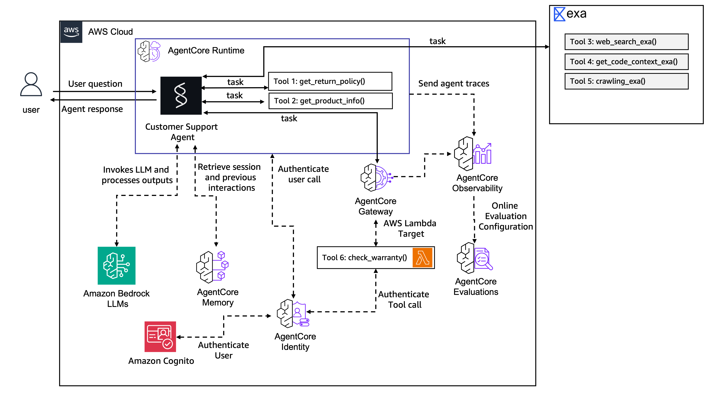

# Customer Support AI Agent — AWS AgentCore

A hands-on project from **BeSA Cohort 10: Agentic AI from POC to Production on AWS**. Built during the [Getting Started with Amazon Bedrock AgentCore](https://catalog.workshops.aws/agentcore-getting-started/en-US) workshop.

The agent answers product questions, checks return policies, looks up warranty status via a real Lambda function, searches the web, and remembers returning customers across sessions.

## What We Built



A customer support agent deployed on **Amazon Bedrock AgentCore** with:

| Feature | Lab | What It Does |
|---|---|---|
| Custom tools | [Lab 1](docs/lab1-building-the-agent.md) | `get_return_policy`, `get_product_info` + Exa AI web search |
| Memory | [Lab 2](docs/lab2-adding-memory.md) | Remembers customer names, preferences, purchases across sessions |
| Gateway | [Lab 3](docs/lab3-scaling-tools-with-gateway.md) | Exposes a real Lambda (warranty check) as an MCP tool |
| JWT Auth | [Lab 4](docs/lab4-securing-and-observing-in-production.md) | Cognito authentication on Runtime + Gateway |
| Observability | [Lab 4](docs/lab4-securing-and-observing-in-production.md) | CloudWatch traces, logs, GenAI Observability dashboard |
| Quality Evaluation | [Lab 5](docs/lab5-evaluating-agent-quality.md) | LLM-as-Judge scoring: goal success, correctness, tool selection |
| Chat Interface | [Lab 6](docs/lab6-building-the-customer-interface.md) | Flask web UI with Cognito authentication |
| Cedar Policies | [Lab 7](docs/lab7-governing-agent-actions-with-policies.md) | Refund limits, warranty access, sensitive info guardrails |
| Zero-Code Agents | [Lab 8](docs/lab8-zero-code-agents-with-harness.md) | Harness agents, OAuth egress, human-in-the-loop |
| Optimization | [Lab 9](docs/lab9-optimizing-agent-quality.md) | AI-driven recommendations and A/B testing |

**Stack:** Strands Agents + Amazon Nova Pro + AgentCore Runtime/Memory/Gateway + CloudWatch + Evaluations

## Labs Progress

| Lab | Topic | Status |
|---|---|---|
| [Lab 1](docs/lab1-building-the-agent.md) | Building the Agent Prototype | ✅ |
| [Lab 2](docs/lab2-adding-memory.md) | Add Memory to Your Agent | ✅ |
| [Lab 3](docs/lab3-scaling-tools-with-gateway.md) | Scaling Tools with Gateway | ✅ |
| [Lab 4](docs/lab4-securing-and-observing-in-production.md) | Securing and Observing in Production | ✅ |
| [Lab 5](docs/lab5-evaluating-agent-quality.md) | Evaluating Agent Quality | ✅ |
| [Lab 6](docs/lab6-building-the-customer-interface.md) | Building the Customer Interface | ✅ |
| [Lab 7](docs/lab7-governing-agent-actions-with-policies.md) | Governing Agent Actions with Policies | ✅ |
| [Lab 8](docs/lab8-zero-code-agents-with-harness.md) | Zero-Code Agents with AgentCore Harness | ✅ |
| [Lab 9](docs/lab9-optimizing-agent-quality.md) | Optimizing Agent Quality | ✅ |

## Prerequisites

**Tools:**

| Tool | Install |
|---|---|
| Node.js 20+ | `nvm install 20` |
| uv | `curl -LsSf https://astral.sh/uv/install.sh \| sh` |
| AWS CLI | `aws configure` |
| AgentCore CLI | `npm install -g @aws/agentcore@latest` |

**AWS Account:**

1. Configure credentials for `us-east-1`:
   ```bash
   aws configure
   export AWS_DEFAULT_REGION=us-east-1
   ```

2. Deploy the prerequisites stack (Cognito, Lambda, SSM params):
   ```bash
   aws cloudformation deploy \
     --template-file cloudformation/prereqs.yaml \
     --stack-name agentcore-workshop-prereqs \
     --capabilities CAPABILITY_IAM CAPABILITY_NAMED_IAM \
     --region us-east-1
   ```

3. Enable Transaction Search for observability:
   ```bash
   aws xray update-indexing-rule \
     --name Default \
     --rule '{"Probabilistic": {"DesiredSamplingPercentage": 100}}'
   ```

## Getting Started

```bash
# Clone
git clone https://github.com/wazaglo/besa-anatomy-of-agentic-ai.git
cd besa-anatomy-of-agentic-ai/app/CustomerSupport

# Install dependencies
uv sync

# Run locally
agentcore dev

# Test locally (another terminal)
agentcore invoke "What's the return policy for electronics?"
```

## Deploy to AWS

```bash
agentcore deploy
```

First deploy takes 2-5 minutes. Then:

```bash
agentcore status

# Test memory (Lab 2+)
SESSION=$(python3 -c 'import uuid; print(uuid.uuid4())')
agentcore invoke "My name is Sarah and I prefer email updates." \
  --session-id $SESSION \
  -H "X-Amzn-Bedrock-AgentCore-Runtime-Custom-User-Id: Sarah" --stream

sleep 2m

SESSION2=$(python3 -c 'import uuid; print(uuid.uuid4())')
agentcore invoke "Do you know anything about me?" \
  --session-id $SESSION2 \
  -H "X-Amzn-Bedrock-AgentCore-Runtime-Custom-User-Id: Sarah" --stream
```

## Replicating in a Different Account

This repo is a complete source of truth. Everything needed to replicate the deployment is here — agent configs, Lambda code (inline in CloudFormation), Cedar policies, harness configs, gateway schemas, and CDK infrastructure. Here's how to redeploy from scratch:

**1. Prerequisites**

Ensure your target account has:
- Amazon Bedrock model access enabled for `amazon.nova-pro-v1:0` in `us-east-1`
- IAM permissions for CloudFormation, Lambda, Cognito, SSM, Bedrock AgentCore

**2. Deploy the prerequisites stack**

```bash
aws cloudformation deploy \
  --template-file cloudformation/prereqs.yaml \
  --stack-name agentcore-workshop-prereqs \
  --capabilities CAPABILITY_IAM CAPABILITY_NAMED_IAM \
  --region us-east-1
```

This creates Cognito (user pool, clients, domain), 2 Lambda functions (warranty check + refund), IAM roles, and SSM parameters. All values are auto-generated — no manual configuration needed.

**3. Update the deployment target**

Edit `agentcore/aws-targets.json` with your account ID:
```json
[{
  "name": "default",
  "description": "Default target (us-east-1)",
  "account": "YOUR_ACCOUNT_ID",
  "region": "us-east-1"
}]
```

**4. Deploy AgentCore resources**

```bash
cd app/CustomerSupport
uv sync
agentcore deploy
```

This deploys 2 runtimes, gateway, memory, policy engine, 3 harnesses, 2 eval configs, and credential provider. Takes 2-5 minutes.

**5. Update Cedar policy gateway ARNs**

After the first deploy, the gateway ARN is generated with a unique hash. Update the 3 Cedar policy files in `app/CustomerSupport/policies/` with the new gateway ARN from `agentcore status`:

- `refund_limit_policy.cedar`
- `warranty_check_policy.cedar`
- `block_sensitive_info.cedar`

Then redeploy: `agentcore deploy`

**6. Create the workshop user**

```bash
aws cognito-idp admin-create-user \
  --user-pool-id $(aws ssm get-parameter --name /app/customersupport/agentcore/pool_id --query Parameter.Value --output text) \
  --username workshopuser@example.com \
  --user-attributes Name=email,Value=workshopuser@example.com Name=email_verified,Value=true \
  --temporary-password "WorkshopPass1!"
```

**7. Configure secrets (optional)**

If using Exa AI web search, set the API key in `agentcore/.env.local`:
```
EXA_API_KEY=your_key_here
```

**Note:** The Flask frontend (`app/CustomerSupport/frontend/frontend.py`) has hardcoded workshop credentials on lines 33-34. Update these if using a different user.

## Project Structure

```
CustomerSupport/
├── agentcore/
│   ├── agentcore.json            # Runtime + memory + gateway + policies + harnesses
│   ├── aws-targets.json          # Deployment targets (account + region)
│   └── cdk/                      # CDK infrastructure
├── app/
│   ├── CustomerSupport/          # Main agent (Python, Strands)
│   │   ├── main.py               # Agent entry point + tools + auth
│   │   ├── model/load.py         # Model config (Amazon Nova Pro)
│   │   ├── memory/session.py     # Memory session manager
│   │   ├── mcp_client/client.py  # Exa AI + Gateway MCP clients
│   │   ├── policies/             # Cedar policy files (Lab 7)
│   │   ├── tool/                 # Gateway tool schemas
│   │   └── frontend/             # Flask chat UI (Lab 6)
│   ├── CustomerSupportAB/        # A/B testing runtime (Lab 9)
│   ├── OrderResearchAgent/       # Zero-code harness agent (Lab 8)
│   ├── PersistentReportAgent/    # Persistent storage harness (Lab 8)
│   └── ContainerAgent/           # Container-based harness (Lab 8)
├── cloudformation/
│   └── prereqs.yaml              # CloudFormation template (Cognito + Lambda + SSM)
└── docs/
    ├── images/                   # Architecture diagrams
    └── lab[1-9]-*.md             # Workshop lab documentation
```

## What Each Lab Covers

| Lab | Key Concepts |
|---|---|
| **Lab 1** | Scaffold project, add custom tools, connect Exa AI MCP, deploy to AgentCore Runtime |
| **Lab 2** | Add SEMANTIC + SUMMARIZATION memory, session isolation, cross-session recall |
| **Lab 3** | Create Gateway, expose Lambda as MCP tool, tool schema, gateway MCP client |
| **Lab 4** | Cognito JWT auth on Runtime + Gateway, extract user from token, CloudWatch observability |
| **Lab 5** | Online evaluation with LLM-as-Judge (goal success, correctness, tool selection) |
| **Lab 6** | Flask web chat interface with Cognito auth, direct AgentCore REST API calls |
| **Lab 7** | Cedar policies for tool governance: refund limits, warranty access, sensitive info guardrails |
| **Lab 8** | Zero-code harness agents, OAuth egress, shell access, human-in-the-loop inline functions |
| **Lab 9** | AI-driven system prompt and tool description recommendations, config bundles, A/B testing |

## Cleanup

AgentCore Runtime and Bedrock model invocations are billable. Always tear down when done.

**Quick teardown (recommended):**

```bash
# Destroy all AgentCore resources via CDK
cd agentcore/cdk
npx cdk destroy

# Delete prerequisites (Cognito, Lambdas, IAM, SSM)
aws cloudformation delete-stack --stack-name agentcore-workshop-prereqs
```

**Granular teardown (remove resources individually):**

```bash
# Remove online eval configs
agentcore remove online-eval --name QualityMonitor -y
agentcore remove online-eval --name ABQualityMonitor -y

# Remove harnesses
agentcore remove harness --name OrderResearchAgent -y
agentcore remove harness --name PersistentReportAgent -y
agentcore remove harness --name ContainerAgent -y

# Remove runtimes
agentcore remove runtime --name CustomerSupportAB -y
agentcore remove runtime --name CustomerSupport -y

# Remove gateway, credential, memory, policy engine
agentcore remove gateway --name my-gateway-secure -y
agentcore remove credential --name gateway-egress-oauth -y
agentcore remove memory --name SharedMemory -y
agentcore remove policy-engine --name CustomerSupportPolicyEngine -y

# Deploy to tear down the CloudFormation stack
agentcore deploy

# Delete prerequisites
aws cloudformation delete-stack --stack-name agentcore-workshop-prereqs
```

## Cost

Lab 1-5 testing: **under $3 total**. Nova Pro is ~$0.0008/1K input tokens. Always clean up to avoid ongoing charges.

## Model Choice

The workshop uses `global.anthropic.claude-sonnet-4-6` but that requires a use case form in Bedrock console. We use `amazon.nova-pro-v1:0` (pre-approved, cheaper, capable enough for this demo).

## Resources

- [Workshop: Getting Started with AgentCore](https://catalog.workshops.aws/agentcore-getting-started/en-US)
- [BeSA Cohort 10](https://besa.techexpert.io/program/self-paced-become-a-solutions-architect-agentic-ai-on-aws-3849)
- [Amazon Bedrock AgentCore Docs](https://docs.aws.amazon.com/bedrock-agentcore/latest/devguide/)
- [Strands Agents Framework](https://github.com/strands-agents)
