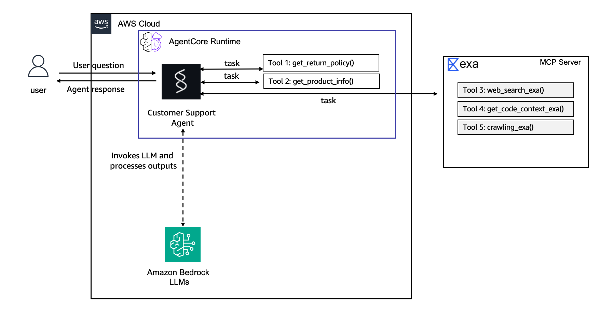

# Lab 1: Building the Agent Prototype

**Duration:** ~20 minutes
**Workshop Reference:** [Lab 1](https://catalog.workshops.aws/agentcore-getting-started/en-US/20-lab1-agent)

## Overview

Built a customer support agent that answers product questions, looks up return policies, and searches the web for troubleshooting help. Scaffolded the project with the AgentCore CLI, added custom tools, tested locally, and deployed to AgentCore Runtime.

## What Was Built

### Tools

| Tool | Purpose |
|---|---|
| `get_return_policy` | Returns return policy by product category (electronics, accessories, audio) |
| `get_product_info` | Searches products by name, ID, or keyword |
| Exa AI MCP | Web search for troubleshooting and general questions |

### Model

- **Workshop default:** `global.anthropic.claude-sonnet-4-6`
- **Our choice:** `amazon.nova-pro-v1:0` (pre-approved, cheaper)

### Framework

- **Strands Agents**: Python SDK for building agents on Bedrock

## Project Structure

```
CustomerSupport/
├── AGENTS.md                          # AI assistant context
├── README.md
├── agentcore/
│   ├── agentcore.json                 # Project config
│   ├── aws-targets.json               # Deployment targets
│   ├── .env.local                     # API keys (gitignored)
│   └── cdk/                           # CDK infrastructure
└── app/
    └── CustomerSupport/
        ├── main.py                    # Agent entry point + tools
        ├── model/
        │   └── load.py                # Model configuration
        ├── mcp_client/
        │   └── client.py              # Exa AI MCP client
        └── memory/
            ├── __init__.py
            └── session.py             # Added in Lab 2
```

## Key Commands

```bash
# Create project
agentcore create --name CustomerSupport --framework Strands --model-provider Bedrock --memory none

# Run locally
agentcore dev

# Test locally
agentcore invoke "What's the return policy for electronics?"

# Deploy to AWS
agentcore deploy

# Check status
agentcore status

# Invoke deployed agent
agentcore invoke "Tell me about the Wireless Headphones"
```

## Testing Queries

| Query | Expected Behavior |
|---|---|
| "What's the return policy for electronics?" | Calls `get_return_policy("electronics")` → 30-day window |
| "Tell me about the Wireless Headphones" | Calls `get_product_info("headphones")` → product details |
| "Search for common Bluetooth headphone troubleshooting tips" | Uses Exa AI MCP → web search results |
| "I bought a Smart Watch (PROD-002) and want to return it" | Calls both tools → category + return policy |

## Issues Encountered

### Model Access Denied

**Error:**
```
ResourceNotFoundException: Model use case details have not been submitted for this account.
Fill out the Anthropic use case details form before using the model.
```

**Cause:** The Bedrock account hasn't been approved to use `global.anthropic.claude-sonnet-4-6`. AWS requires submitting a use case details form before accessing certain foundation models.

**Solution:** Switched to `amazon.nova-pro-v1:0` which is pre-approved. Updated `model/load.py`:

```python
from strands.models.bedrock import BedrockModel

def load_model() -> BedrockModel:
    return BedrockModel(model_id="amazon.nova-pro-v1:0")
```

## Architecture



The Lab 1 architecture shows the simplest form of an AgentCore agent. The **AgentCore Runtime** hosts a Strands Agent that connects to **Amazon Bedrock** (Nova Pro) for LLM inference. The agent has two types of tools: **local Python tools** (`get_return_policy`, `get_product_info`) defined directly in `main.py`, and an **external MCP tool** (Exa AI) connected via HTTP for web search. All tool logic lives inside the agent's codebase, there's no external service mesh or shared tool infrastructure yet. This is the "prototype" stage: everything is self-contained and ready for testing.

## Files Modified

| File | Change |
|---|---|
| `app/CustomerSupport/main.py` | Replaced sample tool with customer support tools |
| `app/CustomerSupport/model/load.py` | Pinned model to `amazon.nova-pro-v1:0` |
