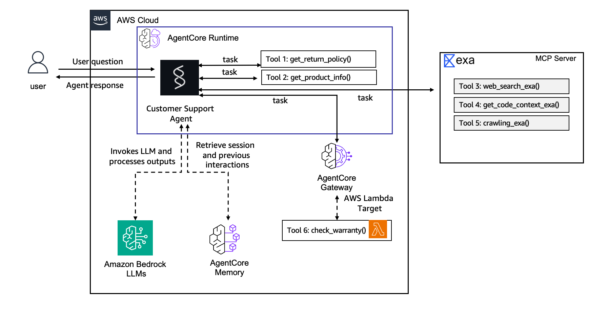

# Lab 3: Scaling Tools with Gateway

**Duration:** ~30 minutes
**Workshop Reference:** [Lab 3](https://catalog.workshops.aws/agentcore-getting-started/en-US/22-lab3-gateway)

## Overview

Exposed an existing Lambda function (`workshop-warranty-check`) as an MCP-compatible tool through AgentCore Gateway. The agent can now discover and call the Lambda without modifying its code. Gateway acts as a managed proxy, your agent connects to a single MCP endpoint and gets access to whatever tools are registered behind it.

## Architecture



The Lab 3 architecture introduces **AgentCore Gateway** as a managed MCP endpoint between the agent and external tools. Instead of calling a Lambda function directly, the agent connects to the Gateway via an MCP client, and the Gateway routes requests to the appropriate target (in this case, the `WarrantyCheck` Lambda). The local tools (`get_return_policy`, `get_product_info`) and the Exa AI MCP connection remain unchanged, they're still called directly by the agent. The Gateway adds a layer of indirection that enables tool sharing across agents, centralized authentication, and the ability to swap backends without modifying agent code. This is the "scaling" stage: tools are no longer coupled to a single agent.

## What Is AgentCore Gateway

Gateway is a managed MCP endpoint that wraps existing services behind a single discoverable interface. Supported target types:

| Target Type | Description |
|---|---|
| AWS Lambda | Wrap existing serverless functions as MCP tools |
| API Gateway REST API | Expose managed REST APIs directly |
| OpenAPI Schema | Point at any OpenAPI-described HTTP service |
| Smithy Model | Use Smithy service models as tool definitions |
| MCP Server | Proxy and secure existing MCP-compatible endpoints |
| Provider Templates | Pre-built connectors for popular third-party services |

In this lab, we used the **Lambda** target type.

## What Was Built

### 1. Tool Schema

Created `app/CustomerSupport/tool/warranty_schema.json` - describes the Lambda tool in natural language so the agent knows what it does and how to call it:

```json
[
  {
    "name": "check_warranty",
    "description": "Check the warranty status of a product by its product ID (e.g. PROD-001). Returns warranty duration, status (active/expired), and expiration date.",
    "inputSchema": {
      "type": "object",
      "properties": {
        "product_id": {
          "type": "string",
          "description": "The product ID to check warranty for (e.g. PROD-001)"
        }
      },
      "required": ["product_id"]
    }
  }
]
```

**Key point:** The `inputSchema` must NOT have a nested `"json"` wrapper. Use `"type": "object"` directly, otherwise deployment fails with "Attribute type null is not yet supported".

### 2. Gateway MCP Client

Updated `app/CustomerSupport/mcp_client/client.py` - added `get_gateway_mcp_client()`:

```python
def get_gateway_mcp_client() -> MCPClient | None:
    """Returns an MCP Client for AgentCore Gateway, if configured"""
    url = os.environ.get("AGENTCORE_GATEWAY_MY_GATEWAY_URL")
    if not url:
        logger.warning("Gateway URL not set — gateway tools unavailable")
        return None
    return MCPClient(lambda: streamablehttp_client(url))
```

- Reads `AGENTCORE_GATEWAY_MY_GATEWAY_URL` from environment (injected by AgentCore Runtime after deployment)
- Returns `None` if not deployed (allows local dev without gateway)

### 3. Gateway Configuration

Updated `agentcore/agentcore.json` - added gateway with Lambda target:

```json
"agentCoreGateways": [
  {
    "name": "my-gateway",
    "protocolType": "None",
    "description": "Gateway for my-gateway",
    "targets": [
      {
        "name": "WarrantyCheck",
        "targetType": "lambdaFunctionArn",
        "lambdaFunctionArn": {
          "lambdaArn": "arn:aws:lambda:us-east-1:195675606509:function:workshop-warranty-check",
          "toolSchemaFile": "app/CustomerSupport/tool/warranty_schema.json"
        }
      }
    ],
    "authorizerType": "NONE",
    "enableSemanticSearch": true,
    "exceptionLevel": "NONE"
  }
]
```

### 4. Updated main.py

Key changes from Lab 2:
- Import `get_gateway_mcp_client` from `mcp_client.client`
- Add gateway client to `mcp_clients` list
- Remove `warranty_months` from PRODUCTS (now fetched via Gateway)

```python
from mcp_client.client import get_streamable_http_mcp_client, get_gateway_mcp_client

# MCP clients: Exa AI (web search) + AgentCore Gateway (Lambda tools)
mcp_clients = [get_streamable_http_mcp_client(), get_gateway_mcp_client()]
```

## Lambda Function: workshop-warranty-check

The Lambda was created by the prerequisites CloudFormation stack. It simulates an enterprise warranty check API:

```python
import json

WARRANTIES = {
    "PROD-001": {"product": "Wireless Headphones", "warranty_months": 12, "status": "active", "expires": "2027-03-01"},
    "PROD-002": {"product": "Smart Watch", "warranty_months": 24, "status": "active", "expires": "2028-01-15"},
    "PROD-003": {"product": "Laptop Stand", "warranty_months": 6, "status": "expired", "expires": "2026-01-01"},
    "PROD-004": {"product": "USB-C Hub", "warranty_months": 12, "status": "active", "expires": "2027-06-20"},
}

def handler(event, context):
    product_id = event.get("product_id", "").upper()
    if product_id in WARRANTIES:
        return {"statusCode": 200, "body": json.dumps(WARRANTIES[product_id])}
    return {"statusCode": 404, "body": json.dumps({"error": f"No warranty found for {product_id}"})}
```

**How Gateway invokes Lambda:** Tool parameters are passed directly in the Lambda event (not inside `event["body"]`). The tool name is available in `context.client_context.custom["bedrockAgentCoreToolName"]`.

## Testing

### Test expired warranty

```bash
SESSION_C=$(python3 -c "import uuid; print(uuid.uuid4())")
agentcore invoke "Check the warranty for product PROD-003" \
  --session-id $SESSION_C \
  -H "X-Amzn-Bedrock-AgentCore-Runtime-Custom-User-Id: Sarah" --stream
```

**Expected:**
```
The warranty for PROD-003 (Laptop Stand) is:
- Warranty Duration: 6 months
- Status: Expired
- Expiration Date: January 1, 2026
```

### Test active warranty

```bash
agentcore invoke "Is the warranty still valid for PROD-002?" \
  --session-id $SESSION_C \
  -H "X-Amzn-Bedrock-AgentCore-Runtime-Custom-User-Id: Sarah" --stream
```

**Expected:** Smart Watch warranty is active until 2028.

## Request Flow

```
agentcore invoke "Check warranty for PROD-003"
    ↓
AgentCore Runtime (CustomerSupport)
    ↓
Agent reads AGENTCORE_GATEWAY_MY_GATEWAY_URL from env
    ↓
MCP Client connects to Gateway
    ↓
Gateway routes to WarrantyCheck Lambda target
    ↓
Lambda executes and returns result
    ↓
Agent synthesizes response
```

## What Changed from Lab 2

| Before (Labs 1-2) | After (Lab 3) |
|---|---|
| Tools are Python functions in main.py | Gateway exposes Lambda as MCP tool |
| Only usable by this agent | Discoverable by any agent via Gateway |
| No way to share tools across teams | Same Gateway can expose multiple targets |
| Warranty data hardcoded in PRODUCTS | Warranty fetched from Lambda via Gateway |

## Key Commands

```bash
# Get Lambda ARN from Parameter Store
WARRANTY_LAMBDA_ARN=$(aws ssm get-parameter \
  --name /app/customersupport/agentcore/warranty_check_lambda_arn \
  --query 'Parameter.Value' --output text)

# Create gateway
agentcore add gateway --name my-gateway --runtimes CustomerSupport

# Add Lambda target
agentcore add gateway-target \
  --type lambda-function-arn \
  --name WarrantyCheck \
  --lambda-arn $WARRANTY_LAMBDA_ARN \
  --tool-schema-file app/CustomerSupport/tool/warranty_schema.json \
  --gateway my-gateway

# Deploy
agentcore deploy -y -v

# Test
agentcore invoke "Check the warranty for product PROD-003" \
  --session-id $SESSION_C \
  -H "X-Amzn-Bedrock-AgentCore-Runtime-Custom-User-Id: Sarah" --stream
```

## Files Modified

| File | Change |
|---|---|
| `app/CustomerSupport/tool/__init__.py` | New file (package init) |
| `app/CustomerSupport/tool/warranty_schema.json` | New file (tool schema for Lambda) |
| `app/CustomerSupport/mcp_client/client.py` | Added `get_gateway_mcp_client()` |
| `app/CustomerSupport/main.py` | Added gateway MCP client, removed warranty_months from PRODUCTS |
| `agentcore/agentcore.json` | Added gateway + WarrantyCheck Lambda target |

## What's Next

Lab 4 will lock down the runtime with JWT authentication and explore observability (tracing, logging).
