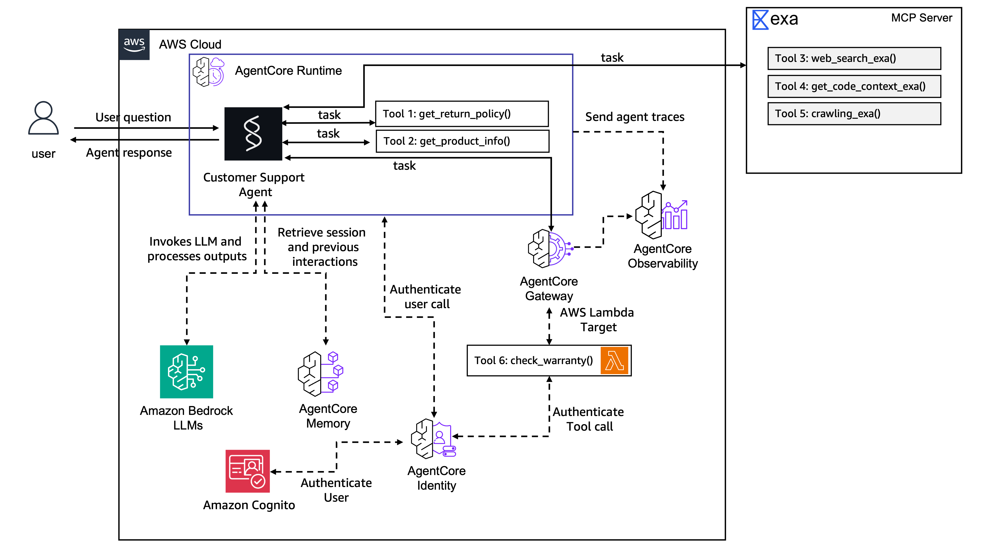

# Lab 4: Securing and Observing in Production

**Duration:** ~15 minutes
**Workshop Reference:** [Lab 4](https://catalog.workshops.aws/agentcore-getting-started/en-US/23-lab4-secure-observe)

## Overview

Locked down the agent runtime and gateway with JWT authentication using Amazon Cognito, and explored observability features. The agent now validates incoming JWT tokens, extracts user identity from claims for memory access, and propagates the token to the secured gateway for end-to-end authentication.

## Architecture



The Lab 4 architecture secures both entry points with **Cognito JWT authentication**. The client sends a Bearer token that AgentCore Runtime validates before it reaches agent code. The `extract_user_id()` function reads the `username` claim from the JWT to scope memory access — no more custom headers. The agent then propagates the same token to the **secured Gateway** (`my-gateway-secure`), which also validates it before routing to the Lambda. This creates end-to-end identity propagation: the same Cognito user authenticates at both the Runtime and Gateway hops. Meanwhile, **CloudWatch GenAI Observability** automatically collects OpenTelemetry traces from all three services (Runtime, Gateway, Lambda), giving you full visibility into every request path.

## What's Already Running

| Resource | Status | Created In |
|---|---|---|
| AgentCore Runtime | ✅ READY | Lab 2 |
| AgentCore Memory | ✅ Deployed | Lab 2 |
| AgentCore Gateway | ✅ Deployed | Lab 3 |
| CloudWatch Observability | ✅ Active | Automatic |

## Part 1: Session Continuity & Isolation

### Session Persistence (same session = remembers)

```bash
SESSION_1=$(python3 -c 'import uuid; print(uuid.uuid4())')
agentcore invoke "My name is Alex and I just bought a Mechanical Keyboard" \
  --session-id $SESSION_1 \
  -H "X-Amzn-Bedrock-AgentCore-Runtime-Custom-User-Id: Alex" \
  --stream

agentcore invoke "What did I just buy?" \
  --session-id $SESSION_1 \
  -H "X-Amzn-Bedrock-AgentCore-Runtime-Custom-User-Id: Alex" \
  --stream
```

**Expected:** Agent remembers Alex bought a Mechanical Keyboard (live conversation state).

### Session Isolation (new session, same user = doesn't remember)

```bash
SESSION_2=$(python3 -c 'import uuid; print(uuid.uuid4())')
agentcore invoke "What did I just buy?" \
  --session-id $SESSION_2 \
  -H "X-Amzn-Bedrock-AgentCore-Runtime-Custom-User-Id: Alex" \
  --stream
```

**Expected:** Agent does not know what Alex bought (new session, no memory yet).

### Memory Recall (new session, existing user = remembers via Memory)

```bash
SESSION_3=$(python3 -c 'import uuid; print(uuid.uuid4())')
agentcore invoke "Do you know anything about me?" \
  --session-id $SESSION_3 \
  -H "X-Amzn-Bedrock-AgentCore-Runtime-Custom-User-Id: Sarah" \
  --stream
```

**Expected:** Agent knows Sarah's name, preferences, and purchase history from Lab 2 memory.

### Session Persistence vs. AgentCore Memory

| | Session Persistence (Runtime) | AgentCore Memory |
|---|---|---|
| **Scope** | Within one session-id | Across all sessions for a user-id |
| **Mechanism** | Live conversation state in microVM | Aggregated facts stored durably |
| **Lifetime** | Until session terminates (15 min idle / 8 hr max) | Permanent (until expiry policy) |
| **Requires setup** | No — built into Runtime | Yes — configured in Lab 2 |

## Part 2: Observability

### View Traces

```bash
agentcore traces list --limit 10

# Download a specific trace
agentcore traces get <trace-id> --output trace.json
```

### View Logs

```bash
# Stream live logs
agentcore logs

# Search recent errors
agentcore logs --since 1h --level error

# Search for specific keyword
agentcore logs --since 1h --query "warranty"
```

### CloudWatch Console

Navigate to **GenAI Observability → Bedrock AgentCore** in CloudWatch:
- **Agents** — See CustomerSupport agent
- **Sessions** — All conversation sessions
- **Traces** — Detailed request traces with latency breakdown

## Part 3: Secure Runtime with Cognito JWT

### Retrieve Cognito Configuration

```bash
COGNITO_DISCOVERY_URL=$(aws ssm get-parameter \
  --name /app/customersupport/agentcore/cognito_discovery_url \
  --query 'Parameter.Value' --output text)

COGNITO_CLIENT_ID=$(aws ssm get-parameter \
  --name /app/customersupport/agentcore/client_id \
  --query 'Parameter.Value' --output text)

COGNITO_POOL_ID=$(aws ssm get-parameter \
  --name /app/customersupport/agentcore/pool_id \
  --query 'Parameter.Value' --output text)

COGNITO_WEB_CLIENT_ID=$(aws ssm get-parameter \
  --name /app/customersupport/agentcore/web_client_id \
  --query 'Parameter.Value' --output text)
```

### Update agentcore.json

Added JWT authorizer to the runtime:

```json
"requestHeaderAllowlist": [
  "X-Amzn-Bedrock-AgentCore-Runtime-Custom-User-Id",
  "Authorization"
],
"authorizerType": "CUSTOM_JWT",
"authorizerConfiguration": {
  "customJwtAuthorizer": {
    "discoveryUrl": "https://cognito-idp.us-east-1.amazonaws.com/us-east-1_qZ9eMpY7y/.well-known/openid-configuration",
    "allowedClients": ["5vot9313rbrhv7c1eo30r56bkc", "7ccc2kh61scnb5v90qkj8nt149"]
  }
}
```

### Add PyJWT Dependency

```bash
cd app/CustomerSupport
uv add pyjwt
cd ../..
```

### Update Agent Code

Added `extract_user_id()` to main.py:

```python
import jwt

def extract_user_id(auth_header) -> str | None:
    """Extract user_id from JWT bearer token (username claim)."""
    if auth_header and auth_header.startswith("Bearer "):
        try:
            token = auth_header.split(" ", 1)[1]
            claims = jwt.decode(token, options={"verify_signature": False})
            username = claims.get("username")
            if username:
                return username
        except Exception as e:
            log.warning(f"Failed to decode JWT for user_id: {e}")
    raise Exception("No authorization header")
```

### Deploy & Test

```bash
agentcore validate
agentcore deploy -y -v
```

## Part 4: Secure Gateway with Cognito JWT

### Remove Old Gateway

```bash
agentcore remove gateway --name my-gateway -y
```

### Create Secured Gateway

```bash
agentcore add gateway --name my-gateway-secure --runtimes CustomerSupport \
  --authorizer-type CUSTOM_JWT \
  --discovery-url $COGNITO_DISCOVERY_URL \
  --allowed-clients $COGNITO_CLIENT_ID,$COGNITO_WEB_CLIENT_ID
```

### Re-add Warranty Check Target

```bash
WARRANTY_LAMBDA_ARN=$(aws ssm get-parameter \
  --name /app/customersupport/agentcore/warranty_check_lambda_arn \
  --query 'Parameter.Value' --output text)

agentcore add gateway-target \
  --type lambda-function-arn \
  --name WarrantyCheck \
  --lambda-arn $WARRANTY_LAMBDA_ARN \
  --tool-schema-file app/CustomerSupport/tool/warranty_schema.json \
  --gateway my-gateway-secure
```

### Update MCP Client

Updated `client.py` — new env var name + auth header propagation:

```python
def get_gateway_mcp_client(auth_header: str) -> MCPClient | None:
    """Returns an MCP Client for AgentCore Gateway, if configured"""
    url = os.environ.get("AGENTCORE_GATEWAY_MY_GATEWAY_SECURE_URL")
    if not url:
        logger.warning("Gateway URL not set — gateway tools unavailable")
        return None
    return MCPClient(lambda: streamablehttp_client(
        url=url,
        headers={"Authorization": auth_header}
    ))
```

### Update main.py

Gateway MCP client now created per-request (each request may carry a different token):

```python
def get_or_create_agent(session_id, user_id, auth_header):
    global _agent
    session_manager = get_memory_session_manager(session_id, user_id)
    mcp_clients = [get_streamable_http_mcp_client(), get_gateway_mcp_client(auth_header)]
    tools = [get_return_policy, get_product_info]
    for mcp_client in mcp_clients:
        if mcp_client:
            tools.append(mcp_client)
    if _agent is None:
        _agent = Agent(model=load_model(), session_manager=session_manager,
                       system_prompt=SYSTEM_PROMPT, tools=tools)
    return _agent

@app.entrypoint
async def invoke(payload, context):
    session_id = context.session_id
    request_headers = context.request_headers or {}
    auth_header = request_headers.get('Authorization', '')
    if not auth_header:
        raise Exception("No authorization header")
    user_id = extract_user_id(auth_header)
    agent = get_or_create_agent(session_id, user_id, auth_header)
    stream = agent.stream_async(payload.get("prompt"))
    async for event in stream:
        if "data" in event and isinstance(event["data"], str):
            yield event["data"]
```

### Create Test User & Get Token

```bash
aws cognito-idp admin-create-user \
  --user-pool-id $COGNITO_POOL_ID \
  --username workshopuser@example.com \
  --temporary-password 'TempPass1!' \
  --user-attributes Name=email,Value=workshopuser@example.com Name=email_verified,Value=true \
  --message-action SUPPRESS

aws cognito-idp admin-set-user-password \
  --user-pool-id $COGNITO_POOL_ID \
  --username workshopuser@example.com \
  --password 'WorkshopPass1!' \
  --permanent

TOKEN=$(aws cognito-idp initiate-auth \
  --auth-flow USER_PASSWORD_AUTH \
  --client-id $COGNITO_WEB_CLIENT_ID \
  --auth-parameters USERNAME=workshopuser@example.com,PASSWORD='WorkshopPass1!' \
  --query 'AuthenticationResult.AccessToken' --output text)
```

### Test with JWT

```bash
SESSION_E=$(python3 -c 'import uuid; print(uuid.uuid4())')
agentcore invoke "Check the warranty for PROD-001" \
  --session-id $SESSION_E --bearer-token "$TOKEN" --stream
```

### Test Without Token (should fail)

```bash
agentcore invoke "What's the return policy for electronics?" \
  --session-id $SESSION_E --stream --json
```

## Part 5: Generate Test Traffic

```bash
SESSION_D=$(python3 -c 'import uuid; print(uuid.uuid4())')

agentcore invoke "What's the return policy for accessories?" \
  --session-id $SESSION_D --bearer-token "$TOKEN" --stream

agentcore invoke "Tell me about the USB-C Hub" \
  --session-id $SESSION_D --bearer-token "$TOKEN" --stream

agentcore invoke "Check the warranty for PROD-002" \
  --session-id $SESSION_D --bearer-token "$TOKEN" --stream

agentcore invoke "Do you remember my name?" \
  --session-id $SESSION_D --bearer-token "$TOKEN" --stream
```

### Refresh Token (if expired)

```bash
TOKEN=$(aws cognito-idp initiate-auth \
  --auth-flow USER_PASSWORD_AUTH \
  --client-id $COGNITO_WEB_CLIENT_ID \
  --auth-parameters USERNAME=workshopuser@example.com,PASSWORD='WorkshopPass1!' \
  --query 'AuthenticationResult.AccessToken' --output text)
```

## Files Modified

| File | Change |
|---|---|
| `agentcore/agentcore.json` | Added JWT authorizer to runtime + secure gateway with JWT |
| `app/CustomerSupport/main.py` | Added `extract_user_id()`, per-request gateway client with auth propagation |
| `app/CustomerSupport/mcp_client/client.py` | Added `auth_header` parameter, new env var `AGENTCORE_GATEWAY_MY_GATEWAY_SECURE_URL` |
| `app/CustomerSupport/pyproject.toml` | Added `pyjwt` dependency |
| `docs/images/lab4_architecture_diagram.png` | Lab 4 architecture diagram |

## Key Commands

```bash
# Check status
agentcore status

# Observability
agentcore traces list --limit 10
agentcore logs --since 1h --query "warranty"

# Remove old gateway
agentcore remove gateway --name my-gateway -y

# Create secure gateway
agentcore add gateway --name my-gateway-secure --runtimes CustomerSupport \
  --authorizer-type CUSTOM_JWT \
  --discovery-url $COGNITO_DISCOVERY_URL \
  --allowed-clients $COGNITO_CLIENT_ID,$COGNITO_WEB_CLIENT_ID

# Deploy
agentcore validate
agentcore deploy -y -v

# Test with JWT
agentcore invoke "Check the warranty for PROD-001" \
  --session-id $SESSION_E --bearer-token "$TOKEN" --stream
```

## What's Next

Lab 5 will evaluate agent quality using built-in evaluators and custom metrics.
