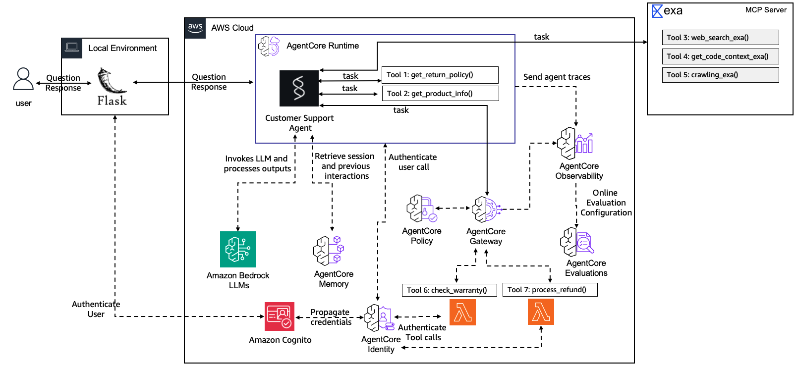

# Lab 7: Governing Agent Actions with Policies

**Duration:** ~20 minutes + ~15 min bonus
**Workshop Reference:** [Lab 7](https://catalog.workshops.aws/agentcore-getting-started/en-US/26-lab7-policies)

## Overview

Added deterministic Cedar policies at the Gateway boundary to control what tools the agent can use and under what conditions. The agent code never changes, policies enforce at the Gateway, before requests reach Lambda. Includes a bonus semantic guardrail that blocks sensitive information (email addresses) in refund reasons using Bedrock Guardrails.

## Architecture



```
Customer → Runtime (JWT) → Agent → Gateway → Cedar Policy Engine → Lambda
                                         │
                                         ├─ refund_limit_policy (amount < 100)
                                         ├─ warranty_check_policy (all users)
                                         └─ BlockSensitiveRefundReasons (EMAIL in reason)
```

Policies are evaluated **deterministically** at the Gateway boundary, the agent can't bypass them even with a clever prompt.

## What Was Built

### 1. ProcessRefund Tool

New Lambda target added to the Gateway with a tool schema:

```json
{
  "name": "process_refund",
  "description": "Process a customer refund for a given order.",
  "inputSchema": {
    "type": "object",
    "properties": {
      "order_id": { "type": "string" },
      "amount": { "type": "integer" },
      "reason": { "type": "string" }
    },
    "required": ["order_id", "amount", "reason"]
  }
}
```

### 2. Policy Engine

```json
{
  "name": "CustomerSupportPolicyEngine",
  "enforcementMode": "ACTIVE",
  "policies": [...]
}
```

- **ENFORCE mode**: denied requests are blocked at the Gateway
- **Default deny**: all actions denied unless explicitly permitted

### 3. Cedar Policies

#### Policy 1: Refund Limit

```cedar
permit(
  principal,
  action == AgentCore::Action::"ProcessRefund___process_refund",
  resource == AgentCore::Gateway::"<GATEWAY_ARN>"
) when {
  context.input.amount < 100
};
```

Only permits refunds under $100. Amounts ≥ $100 are denied.

#### Policy 2: Warranty Check Access

```cedar
permit(
  principal,
  action == AgentCore::Action::"WarrantyCheck___check_warranty",
  resource == AgentCore::Gateway::"<GATEWAY_ARN>"
) when {
  principal is AgentCore::OAuthUser
};
```

All authenticated users can check warranties. Needed because Cedar uses default deny, without this, existing warranty checks would break.

#### Policy 3 (Bonus): Block Sensitive Information

```cedar
forbid(
  principal,
  action == AgentCore::Action::"ProcessRefund___process_refund",
  resource == AgentCore::Gateway::"<GATEWAY_ARN>"
) when guardrails {
  BedrockGuardrails::SensitiveInformation(
    ["EMAIL"], [context.input.reason]
  ).maxConfidenceScore().greaterThanOrEqual(decimal("0.2"))
};
```

Semantic guardrail that detects email addresses in the refund reason using Bedrock Guardrails. `forbid` overrides `permit` - if an email is detected, the refund is blocked regardless of amount.

## Testing

### Without Policy (before deploy)

| Prompt | Result |
|---|---|
| "Refund $500 for ORD-67890" | ✅ Processed (no restrictions) |

### With Policies (after deploy)

| Prompt | Expected | Policy |
|---|---|---|
| "Refund $50 for ORD-12345, item was defective" | ✅ Processed | amount=50 < 100, permitted |
| "Refund $500 for ORD-67890" | ❌ Denied | amount=500 ≥ 100, denied |
| "Check warranty for PROD-002" | ✅ Warranty returned | Explicit permit for all users |
| "Refund $50 for ORD-99999, reason: alice@example.com" | ❌ Blocked | EMAIL detected in reason |
| "Refund $50 for ORD-99999, reason: defective item" | ✅ Processed | No email detected |

### Inspect Policy Decisions

```bash
agentcore logs --since 15m --query "process_refund"
```

Look for `gen_ai.tool.call.arguments` and policy denial messages.

## Key Concepts

| Concept | Description |
|---|---|
| **Policy Engine** | Container for Cedar policies, attached to a Gateway |
| **Cedar Policy** | Declarative rule that permits or forbids tool access |
| **ENFORCE mode** | Denied requests are blocked |
| **LOG_ONLY mode** | Decisions logged but not enforced (testing) |
| **Default Deny** | All actions denied unless explicitly permitted |
| **forbid overrides permit** | `forbid` always wins over `permit` |

## Cedar Patterns

| Pattern | Example |
|---|---|
| Amount limits | `context.input.amount < 1000` |
| Role-based access | `principal.getTag("role") == "manager"` |
| Required fields | `forbid ... unless { context.input has description }` |
| Regional restrictions | `["US", "CA"].contains(context.input.region)` |
| Emergency shutdown | `forbid(principal, action, resource)` |

## Files Created/Modified

| File | Change |
|---|---|
| `app/CustomerSupport/tool/refund_schema.json` | New file — refund tool schema |
| `app/CustomerSupport/policies/refund_limit_policy.cedar` | Cedar policy — refund amount < $100 |
| `app/CustomerSupport/policies/warranty_check_policy.cedar` | Cedar policy — warranty check for all users |
| `app/CustomerSupport/policies/block_sensitive_info.cedar` | Cedar policy — block emails in refund reasons |
| `agentcore/agentcore.json` | Added ProcessRefund target, policy engine with 3 policies |

## Key Commands

```bash
# Get refund Lambda ARN
REFUND_LAMBDA_ARN=$(aws ssm get-parameter \
  --name /app/customersupport/agentcore/refund_lambda_arn \
  --query 'Parameter.Value' --output text)

# Add refund target to gateway
agentcore add gateway-target \
  --type lambda-function-arn \
  --name ProcessRefund \
  --lambda-arn $REFUND_LAMBDA_ARN \
  --tool-schema-file app/CustomerSupport/tool/refund_schema.json \
  --gateway my-gateway-secure

# Create policy engine
agentcore add policy-engine \
  --name CustomerSupportPolicyEngine \
  --description "Governs customer support agent tool access" \
  --attach-to-gateways my-gateway-secure \
  --attach-mode ENFORCE

# Get gateway ARN
GATEWAY_ARN=$(aws bedrock-agentcore-control get-gateway \
  --gateway-identifier $GATEWAY_ID \
  --query "gatewayArn" --output text)

# Add refund limit policy
agentcore add policy \
  --name refund_limit_policy \
  --engine CustomerSupportPolicyEngine \
  --statement "permit(principal, action == AgentCore::Action::\"ProcessRefund___process_refund\", resource == AgentCore::Gateway::\"${GATEWAY_ARN}\") when { context.input.amount < 100 };"

# Add warranty check policy
agentcore add policy \
  --name warranty_check_policy \
  --engine CustomerSupportPolicyEngine \
  --statement "permit(principal, action == AgentCore::Action::\"WarrantyCheck___check_warranty\", resource == AgentCore::Gateway::\"${GATEWAY_ARN}\") when { principal is AgentCore::OAuthUser };" \
  --validation-mode IGNORE_ALL_FINDINGS

# Deploy
agentcore deploy -y -v
```

## What's Next

Lab 8 will create a zero-code agent using AgentCore Harness.
